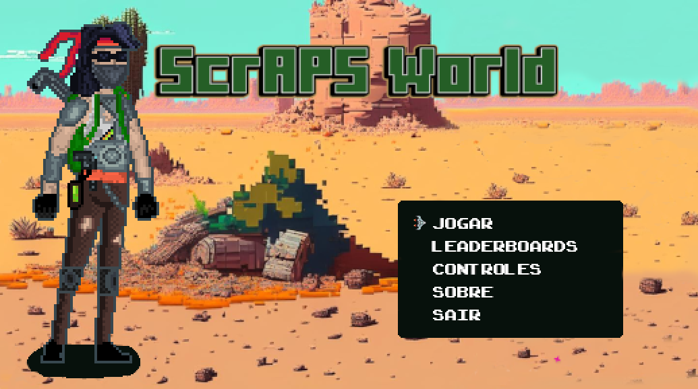
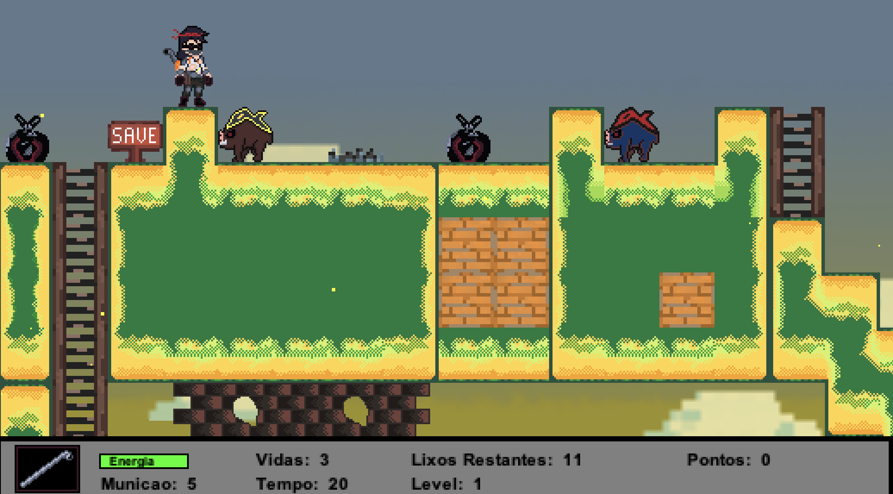

# APS CC3P34  
<h1>ScrAPS Worls</h1>

O Jogo ScrAPS World foi desenvolvido com a finalidade de atender ao pedido proposto pela UNIP na APS do terceiro período do curso de Ciência da Computação. 
O Jogo foi desenvolvido na linguagem JAVA, e utilizando o mínimo de bibliotecas não nativas da mesma (sem uso de engines). 
 
Trata-se de um jogo de plataforma 2D, que utiliza todos os conceitos de Programação Orientada a Objetos (POO). 
As músicas e artes do projeto são proprietárias (desenvolvidas pelos membros do grupo). 
O trabalho escrito pode ser encontrado dentro da pasta src/docs, juntamente com o mapping tiles. 
 
O escopo do jogo está reduzido devido ao pouco tempo que o projeto recebeu, mas ainda assim é passivel de testes. 
 
<h2>Sobre a instalação</h2>
<ol>
  <li>Baixe o conteúdo do repositório</li>
  <li>Descompacte o conteúdo em pasta do computador</li>
  <li>Tenha certeza de estar com a última vesão do Java JDK</li>
  <li>Procure a pasta / arquivo <b><i>src/main/Game.java</i></b></li>
  <li>Com o ambiente configurado, basta rodar a aplicação.  
    (usando a IDE de sua preferência ou compilando e usando o comando javac no arquivo de saída criado pela compilação)</li>
</ol>

 
Também será disponibilizado o artefato Java (jar) na pasta src/artefatos 
O artefado jar pode ser rodado sem a necessidade de IDE.
 
 
Com a entrega do trabalho, uma nova fase se iniciará no projeto, onde vamos procurar disponibilizar o jogo na plataforma STEAM. 
Para tanto, foi criada a equipe "Notorious Team", que vai buscar a adequação do projeto para a disponibilização do público.

 
Seja feliz, é obrigatório 
Todo poder emana do código 

 

